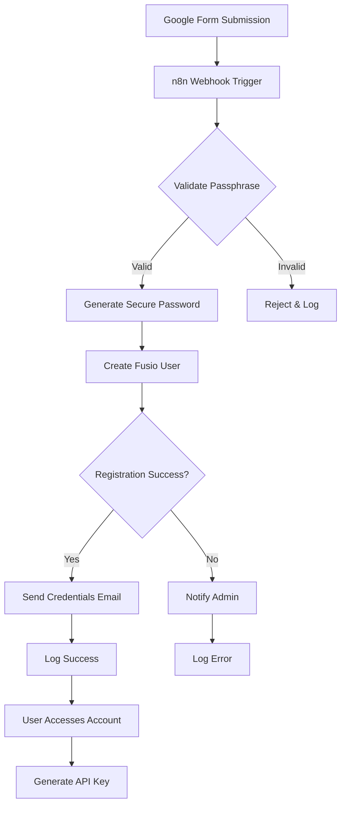

# User Onboarding Workflow - Google Forms to Fusio

Automated user registration system that processes Google Forms submissions and creates users in Fusio API Gateway with secure password generation and email notifications.

## 🎯 Purpose

This workflow automates the user onboarding process for the SPSE Data Gateway:
1. Receives user registration from Google Forms
2. Validates registration passphrase
3. Generates secure passwords
4. Creates users in Fusio API Gateway
5. Sends credentials via email
6. Directs users to generate API keys

## 🚀 Quick Start

### Prerequisites

- Docker and Docker Compose installed
- Google account with Forms access
- Gmail account with 2FA enabled
- Fusio API Gateway running
- Admin access to Fusio

### Setup Steps

1. **Configure Environment**
   ```bash
   cd workflow
   cp .env.example .env
   # Edit .env with your actual values
   ```

2. **Start n8n**
   ```bash
   docker-compose up -d
   ```

3. **Access n8n Interface**
   - URL: http://localhost:5678
   - Default credentials: admin/admin (if basic auth enabled)

4. **Import Workflow**
   ```bash
   # Use the import script
   ./scripts/import_workflow.sh

   # Or manually import in n8n UI:
   # Settings → Workflow → Import from File
   # Select: n8n/workflows/user_onboarding.json
   ```

## 📋 Configuration Guide

### 1. Google Forms Setup

Create a form with these required fields:
- **Email** (Email validation)
- **Full Name** (Short text)
- **Passphrase** (Short text) - Used for validation

### 2. FormLinker Configuration

1. Install FormLinker from Google Workspace Marketplace
2. Open your Google Form
3. Click Add-ons → FormLinker → Configure
4. Set webhook URL: `http://your-n8n-url:5678/webhook/google-forms-webhook`
5. Enable "Send on form submit"
6. Save configuration

### 3. Gmail SMTP Setup

1. **Enable 2-Factor Authentication**
   - Go to Google Account settings
   - Security → 2-Step Verification → Turn on

2. **Generate App Password**
   - Go to https://myaccount.google.com/apppasswords
   - Select "Mail" and "Other (n8n)"
   - Copy the 16-character password
   - Add to .env as GMAIL_APP_PASSWORD

### 4. Fusio API Configuration

1. **Create Admin User**
   ```bash
   # Access Fusio backend
   # Create user with admin privileges
   # Note the username and password
   ```

2. **Configure API Access**
   - Enable consumer registration endpoint
   - Set up API key authentication
   - Configure activation settings

### 5. Environment Variables

Critical variables to configure in `.env`:

```env
# Fusio Settings
FUSIO_API_URL=http://your-fusio-url:8000
FUSIO_API_KEY=your-api-key
FUSIO_ADMIN_USER=admin
FUSIO_ADMIN_PASSWORD=secure-password

# Gmail Settings
GMAIL_USER=your.email@gmail.com
GMAIL_APP_PASSWORD=your-app-password

# Security
FORM_PASSPHRASE=spse2025
N8N_ENCRYPTION_KEY=$(openssl rand -hex 32)
```

## 🔄 Workflow Process

### Flow Diagram



### Workflow Nodes

1. **Webhook Trigger**: Receives FormLinker POST requests
2. **Passphrase Validation**: Checks against configured passphrase
3. **Password Generator**: Creates 16-character secure password
4. **Fusio Registration**: API call to create user
5. **Email Notification**: Sends credentials via Gmail
6. **Error Handling**: Notifies admin of failures
7. **Logging**: Records all registration attempts

## 🧪 Testing

### Test the Workflow

1. **Manual Test**
   ```bash
   ./scripts/test.sh
   ```

2. **Test with Sample Data**
   ```bash
   curl -X POST http://localhost:5678/webhook/google-forms-webhook \
     -H "Content-Type: application/json" \
     -d '{
       "email": "test@example.com",
       "name": "Test User",
       "passphrase": "spse2025"
     }'
   ```

3. **Check Logs**
   ```bash
   docker-compose logs -f n8n
   ```

### Validation Points

- ✅ Webhook receives data
- ✅ Passphrase validation works
- ✅ Password generation succeeds
- ✅ Fusio user creation completes
- ✅ Email sends successfully
- ✅ User can log in
- ✅ API key generation works

## 🔒 Security Considerations

### Password Security

- Passwords are generated using cryptographically secure random
- 16 characters with mixed case, numbers, and symbols
- Never stored in logs or intermediate storage
- Sent only once via secure email

### Data Protection

- All credentials in environment variables
- n8n encryption for stored credentials
- HTTPS recommended for production
- Rate limiting on webhook endpoint

### Access Control

- Passphrase validation prevents unauthorized registrations
- Admin notifications for failed attempts
- Audit logging of all registrations

## 📊 Monitoring

### Health Checks

```bash
# Check n8n status
curl http://localhost:5678/healthz

# Check PostgreSQL
docker exec n8n-postgres pg_isready

# Check workflow execution
# Access n8n UI → Executions
```

### Metrics to Monitor

- Registration success rate
- Average processing time
- Email delivery rate
- Failed registration attempts
- API quota usage

## 🐛 Troubleshooting

### Common Issues

#### 1. Webhook Not Receiving Data
- Check FormLinker configuration
- Verify webhook URL is accessible
- Check n8n container logs

#### 2. Email Not Sending
- Verify Gmail App Password
- Check 2FA is enabled
- Review Gmail API quotas

#### 3. Fusio Registration Fails
- Verify API credentials
- Check Fusio is running
- Review API permissions

#### 4. Password Generation Error
- Check Node.js modules loaded
- Verify crypto module available
- Review function node code

### Debug Commands

```bash
# View all logs
docker-compose logs

# Check specific service
docker-compose logs n8n

# Enter n8n container
docker exec -it n8n sh

# Test database connection
docker exec n8n-postgres psql -U n8n -c "SELECT 1"

# Check workflow status
curl http://localhost:5678/rest/workflows
```

## 🚀 Production Deployment

### Recommended Configuration

1. **Use HTTPS**
   ```env
   N8N_PROTOCOL=https
   WEBHOOK_URL=https://workflow.yourdomain.com
   ```

2. **Enable Authentication**
   ```env
   N8N_BASIC_AUTH_ACTIVE=true
   N8N_BASIC_AUTH_USER=secure-user
   N8N_BASIC_AUTH_PASSWORD=secure-password
   ```

3. **Configure Backups**
   ```yaml
   # Add to docker-compose.yml
   volumes:
     - ./backups:/backups
   ```

4. **Set Resource Limits**
   ```yaml
   services:
     n8n:
       deploy:
         resources:
           limits:
             cpus: '2'
             memory: 2G
   ```

### Scaling Considerations

- Use external PostgreSQL for production
- Implement Redis for workflow queuing
- Configure multiple n8n workers
- Use load balancer for webhooks

## 📚 Additional Resources

- [n8n Documentation](https://docs.n8n.io)
- [Fusio API Docs](https://docs.fusio-project.org)
- [FormLinker Guide](https://workspace.google.com/marketplace)
- [Gmail SMTP Setup](https://support.google.com/mail/answer/185833)

## 🤝 Support

For issues or questions:
1. Check the troubleshooting guide
2. Review n8n execution logs
3. Contact admin@spse-gateway.com

## 📄 License

This workflow is part of the SPSE Data Gateway project.